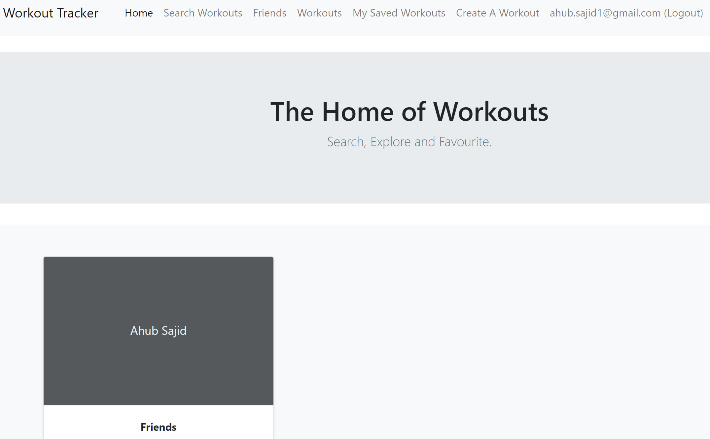
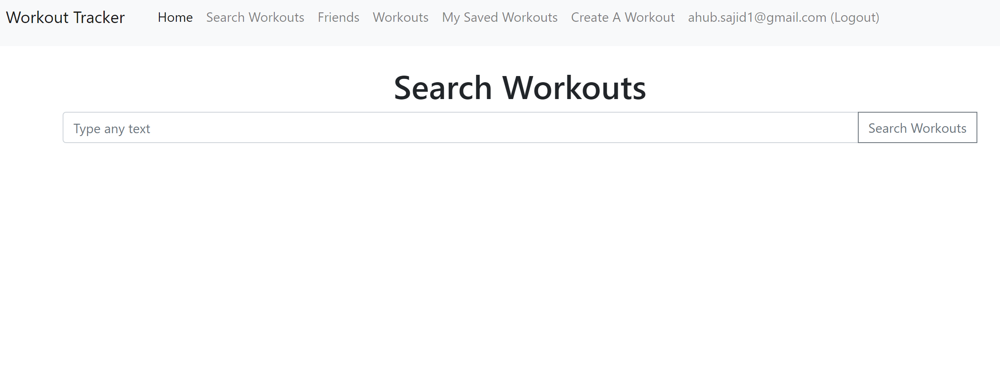
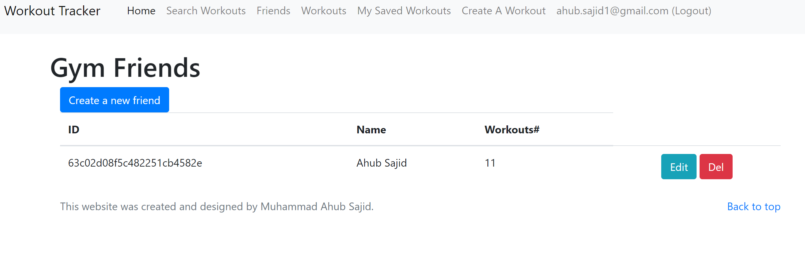
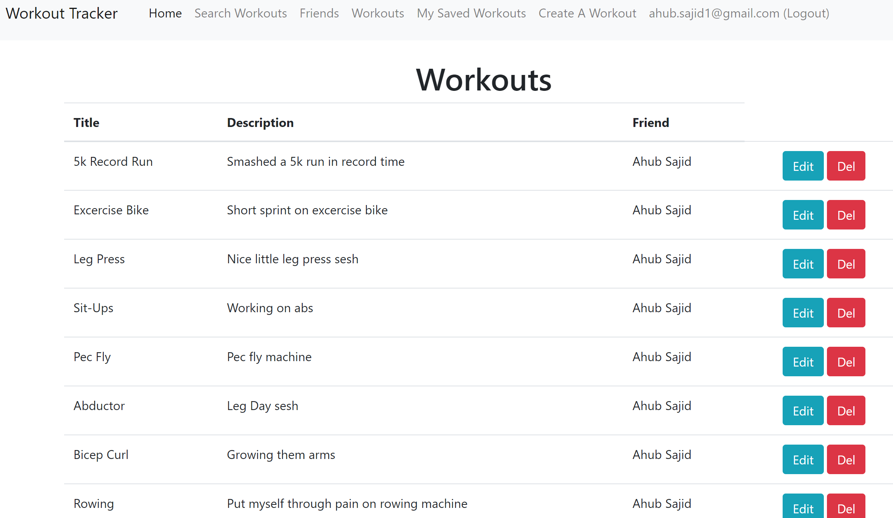
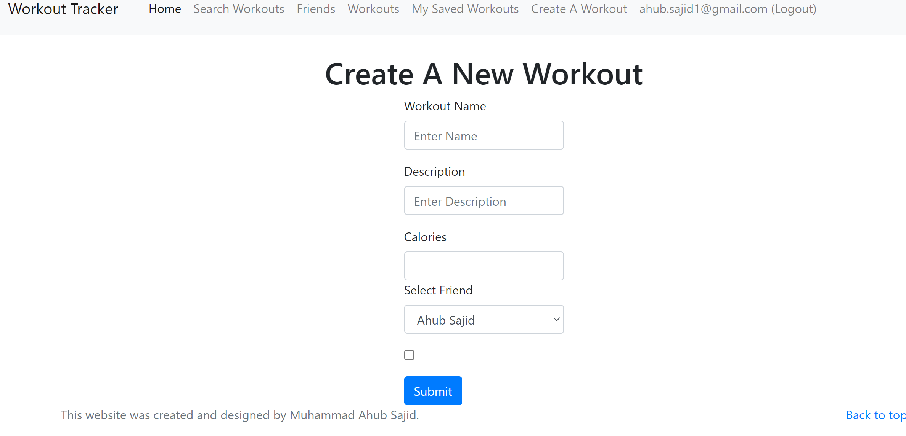

# COM519 AE2 Project - Workout Tracker

### By Muhammad Ahub Sajid

## Introduction
Welcome to my project where I have created a workout tracker for me and my friends to use. A lot of the time we would find ourselves comparing workouts via notes on out phones and we thought that there's got to be a better way to see our results together. That's where this system kicks in.

## Technologies

The application is created using Node.js using the Express.js framework to control the backend of the program. For the user-interface I have used Embedded Javascript (EJS) which is used to pass through the data when displaying to the user. The database for the application is MongoDB and this has been connected to the application using Mongoose. The application is based around an Model-View-Controller (MVC) design that includes 2 types of controllers. One controller type is used to return data to a view that will be displayed to the user and the other controller is an API controller which is used to return JSON objects which is used when implementing AJAX on some of the pages.

## Running the Application

In order to run the application for development, run the following commands:
1. npm install
2. npm run dev

### Example .env

In order for the application to run, an environment file needs to be created (.env). An example of this can be seen below:

# Screenshots

