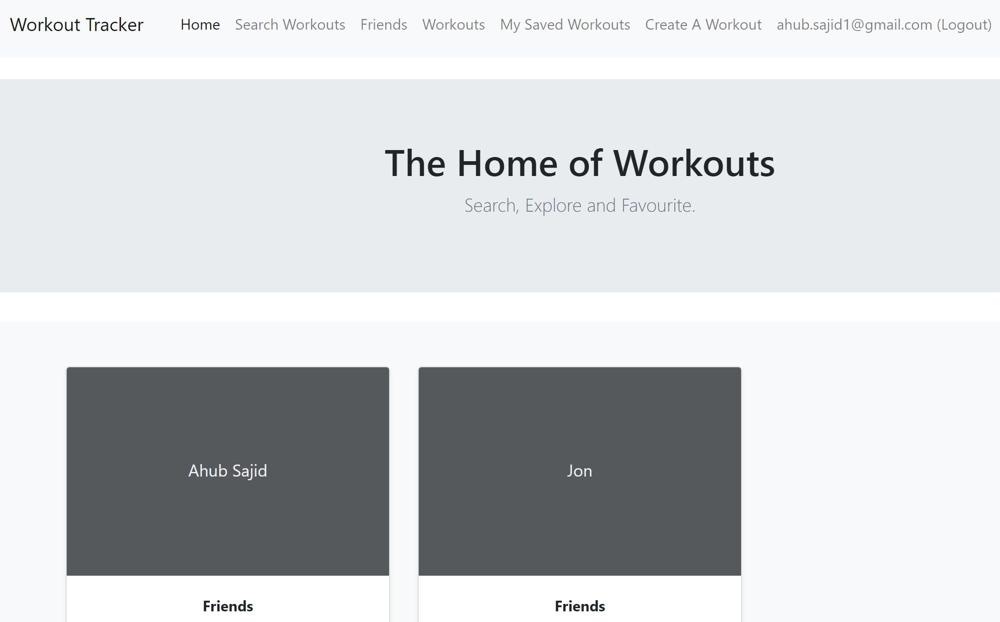
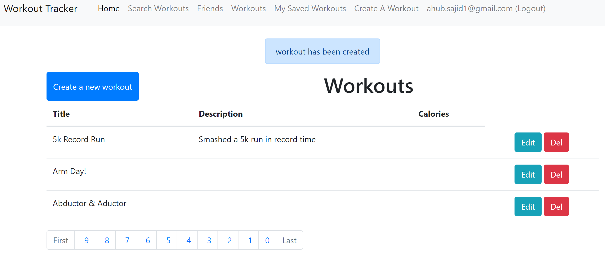
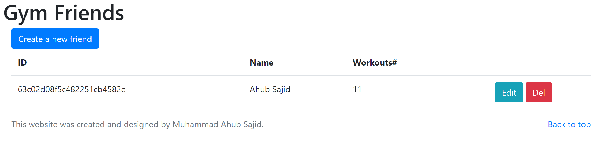
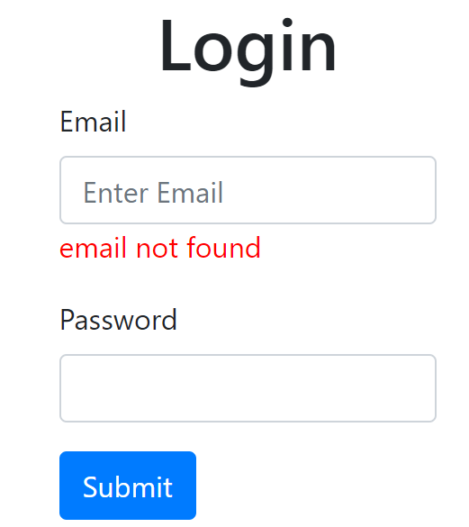
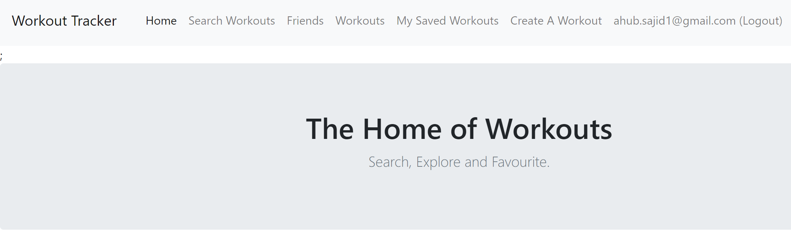
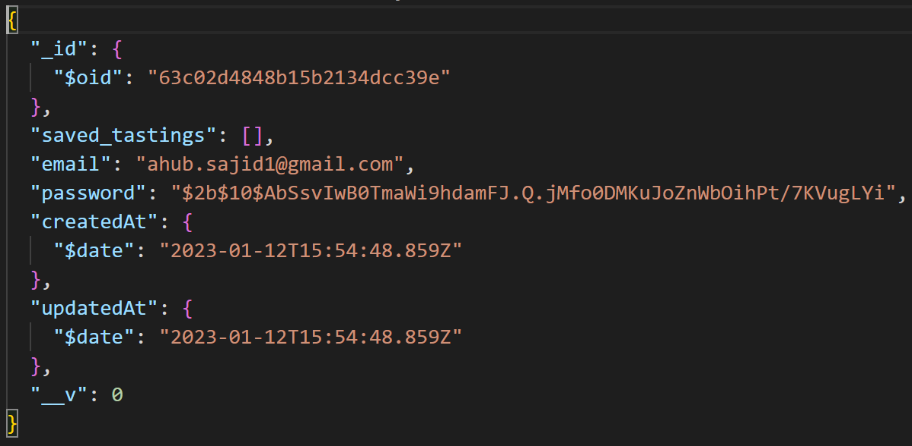
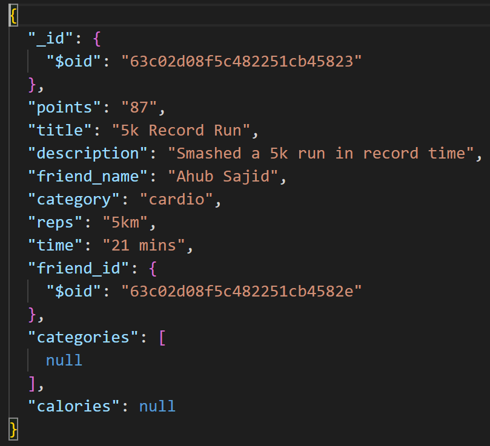

# Workout Tracker Application
Hosted Application:
Repository:

# Introduction
My whole life I have struggled with my weight and have always felt hopeless when it came to getting in-shape. Like many others I've had my moments where I started excercising more and eating less in an attempt to change this however often I felt like my routine was all over the place and questioned whether I was actually achieving anything. In 2022, I started going to the gym and st first my aim was to do unplanned workouts, mostly involving cardio, until I lost some pounds and then switch to a more focused approach. I am now at that point where I can focus on building muscle and getting in better shape so this was the main inspiration for my project.

I have decided to create a tracker for my workouts so that I can keep note of what workouts I have done and keep track of my progress. As well as this benefitting me I will also give access to my gym friends to boost the competition we have between each other on who can get the best physic by the summer as there is a lot of money on the line.

# System Overview
My project is built using Model-View-Controller(MVC) architecture which uses Node.js for all the backend code and then using MongoDB databases via EJS to create the views. Node.js is a tool that makes developing code easier and faster which was the main reason I have used it alongside EJS as it meant I was able to preview the changes as I do them as oppose to waiting for the program to compile and run again. 

The module revolved around the use of MongoDB so it seemed clear that that was going to be the technology that I was going to use to interact with the databases. Of course, MongoDB uses non-realtional databases which can have their pros and cons. The advantages of using non-relational databases is the scalabilty due to the lack of structure in the data and the simplicity of the code required for it. On the other hand, there is a big disadvantage as non-realtional databases can lead to a compromise in data integrity and consistency, however in the scenario of my project this is not a problem.

In terms of the architecture of the system, the reason for choosing to use MVC is the fact that it is very easy to maintain the system no matter the size and this has been proven as a lot of very big websites such as GoDaddy.com or Ancestry.com use this technology.

# Home
The home page is the most important page for a website as it is the first view the user gets of your site. My home page includes a main header that states the functionality of the website and for added looks I have also decided to display the friends in boxes allowing the user to view each friend by clicking on them. I have also included both a header and footer. The header is the navigation bar for the website and includes links to all pages as well as displaying the login information of the user and gives them the ability to register, login and then logout once logged in.

# Workouts
The workouts page shows a list of all workouts that have been entered into the system. I have also added pagination which means that the pages load a lot faster as there is less data that needs to be loaded per page.
The workouts are displayed using their title, a description and friend name and the user is given the option for each workout to edit or delete the workout which will then re-direct them to the appropriate page. As well as this, the user can also add a workout.

# Friends
The friends page is used to display a list of gym friends that have been retrieved from the database. The friend's ID, name and number of workouts is displayed as well as buttons that allow the user to edit or delete the friend. 
The user also has the ability to add a new friend from this page. 

# Login and Register
For a user to perform certain tasks such as viewing saved workouts or creating a new workout they must login. This is only possible if the user has previously registered otherwise they will encounter an error as they won't be found in the database. I have inserted a picture to show what happens when a user who isn't registered tries to log in.

If a new user wants to register they must enter their email and a password into a form which then sends this information to the database. Once they have done this they will be able to login and then perform all tasks as the header displaying the navigation will change to display all tasks and also display the users email as well as a logout button. For added security, the program doesn't save the users password directly but it uses BCrypt in order to hash the password. The user is then signed in and this allows the application to identify the current user from within every controller as the user seesion is set.

# Key Design Decisions

## Database Design

This application consists of a production and development MongoDB database located in MongoDB atlas. Each of the databases have the following 3 collections:
* Users
* Workouts
* Friends

### Users

The users collection stores the login information of each user, allowing workouts to be associated with a user. An example of a user from the collection can be seen below:

As you can see the password us hashed as opposed to being plaintext for added security.

### Workouts

The workouts collection stores the workout information for each workout created. This include all information such as title, reps, category etc. An example of this can be seen below.

### 

